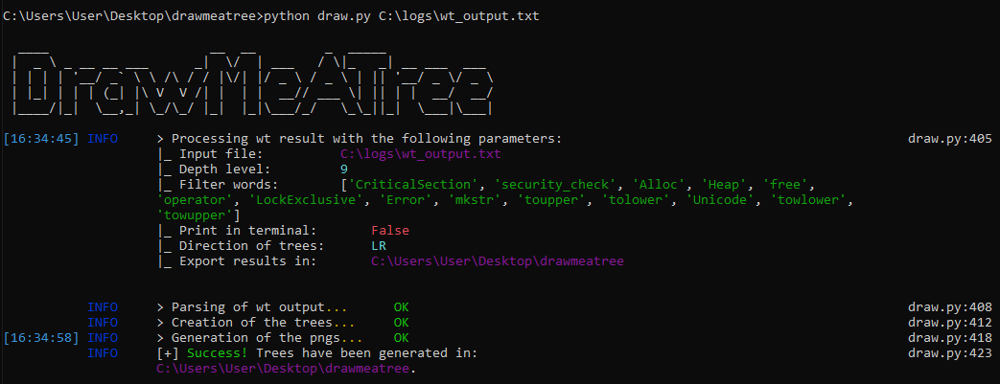

# DrawMeATree
 DrawMeATree is a python tool developped to support the exploitation of the wt Windbg command, generating two graphic trees from the wt output. On the one hand, a "full tree" displaying all the calls made and on the other hand, a "filtered tree" version based on customizable features, resulting in an image similar to:


## 🌟 Tool introduction
#### The problematic: using wt without a headache 
The Windbg command [wt](https://learn.microsoft.com/en-us/windows-hardware/drivers/debugger/wt--trace-and-watch-data-) runs through a function and then displays the list of subfunctions successively called, showing the function calls flow with the following format:
```
0:000> wt
Tracing MyModule!myFunction to return address 00401137
  105     0 [  0] MyModule!myFunction
    1     0 [  1]   MyModule!ILT+1555(_printf)
    9     0 [  1]   MyModule!printf
    1     0 [  2]     MyModule!ILT+370(__stbuf)
   11     0 [  2]     MyModule!_stbuf
    1     0 [  3]       MyModule!ILT+1440(__isatty)
   14     0 [  3]       MyModule!_isatty
   50    15 [  2]     MyModule!_stbuf
....
   11     0 [  5]           kernel32!__SEH_epilog4
   54 11675 [  4]         kernel32!ReadFile
  165 11729 [  3]       MyModule!_read
  100 11895 [  2]     MyModule!_filbuf
   91 11996 [  1]   MyModule!fgets
54545 83789 [  0] MyModule!myFunction
    1     0 [  1]   MyModule!ILT+1265(__RTC_CheckEsp)
    2     0 [  1]   MyModule!_RTC_CheckEsp
54547 83782 [  0] MyModule!myFunction
```
If this command is very useful to understand what a targeted function does, it is common to end up with a few thousands lines of results, that can't be understood nor exploited.

#### Our solution: DrawMeATree
Because an image is worth a thousand words, we developped a tool to visualize this precious amount of information. From a given file containing the result of a wt execution, DrawMeATree will render two graphic trees displaying the functions calls flow; one containing all of the calls made and another one with set up filters, to keep essential information accessible.

These resulting trees will help users to:
- Synthetize a potential large amount of information to one simpler images; 
- Easily identify the names and number of different modules involved;
- Easily identify connections between functions (eg: determine what part of a function is responsible for a system call);
- Using a visual representation of a complex function flow in reports.


## ⚓ Installation
1. Download the last version of GraphViz from: https://graphviz.org/download/ and make sure to select "add to PATH" while installing
2. Install python (<= 3.6) and install requirements using:
```python
pip install -r requirements.txt
```
## 🚀 2-steps usage

#### Step 1: Export the result of wt  
a. From a breakpoint in the target function on Windbg, open a log file to store the command result:
```
.logopen C:\\logfiles\\mylogs.txt”
```
b. Execute `wt` with your parameters


c. Close the logfile:
```
.logclose
```

#### Step 2: Use DrawMeATree to visualize the result 
a. Run from a command line:
```python
python draw.py C:\\logfiles\\mylogs.txt <optional arguments>
```
b. Go check the resulting trees!

## 🕹️ Examples 
```python
usage: draw.py input_file
               [-h] [-c] [-d 1-9] [-o output_directory] [-f filter_level]
               [-a filters_words [filters_words ...]]

Ex: python daw.py wt_output.txt

Arguments:
optional arguments:
  -h, --help            show this help message and exit
  -c, --console         Display the resulting filtered tree in console.
  -d 1-9, --depth 1-9   Defines the depth level of filtering between 1 and 9. Default: 9.
  -o output_directory, --output output_directory
                        Defines the repository to contain the resulting trees. Ex: C:\Myresults
  -f filter_level, --filter filter_level
                        Defines the level of default filtering: light | medium (default) | high.
                                1/ "light": ['CriticalSection', 'security_check', 'Alloc', 'Heap', 'free', 'operator', 'LockExclusive', 'Error', 'mkstr']
                                2/ "medium": ['CriticalSection', 'security_check', 'Alloc', 'Heap', 'free', 'operator', 'LockExclusive', 'Error', 'mkstr', 'toupper', 'tolower', 'Unicode', 'towlower', 'towupper']
                                3/ "high": ['CriticalSection', 'security_check', 'Alloc', 'Heap', 'free', 'operator', 'LockExclusive', 'Error', 'mkstr', 'toupper', 'tolower', 'Unicode', 'towlower', 'towupper', 'memcpy', 'memmove', 'memset', 'Close', 'Rtlp', 'Language', 'initterm', 'Fls']
  -a filters_words [filters_words ...], --addfilters filters_words [filters_words ...]
                        Adsd a list of custom filters. Ex: -a  cmp memcpy
                        
                        
# Example 1: Draw a highly filtered tree and store results in an existing /results directory:
python draw.py wt_output.txt -f high -o results

# Example 2: Draw a lightly filtered tree and add custom filters to exclude CreateFile calls:
python draw.py wt_output.txt -f light -a CreateFile

#Example 3: Draw trees with a maximum depth of 3 levels and display result in console:
python draw.py wt_output.txt -c -d 3
```

## 🖥️ DrawMeATree's interface 
At the execution, DrawMeATree's innterface will display:
- the parameters of the trees generation
- the steps of the live execution
- result of the generation




## 💾 Additional notes 
### Contributors
- Author: [Mathilde Venault](https://github.com/MathildeVenault)
- Reviewers: Garrett Moore, Ian Torres

### Support
DrawMeATree is an open source project, not a CrowdStrike product. As such, it carries no formal support, expressed or implied.

### License
This project is licensed under the MIT License.
